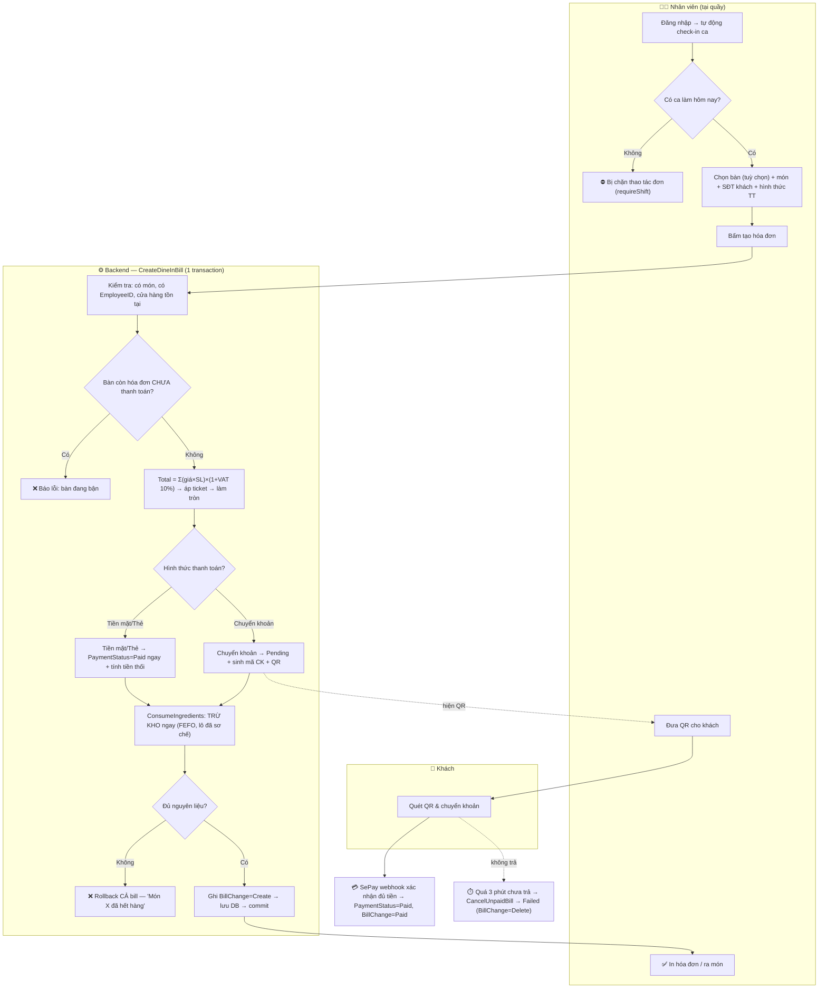
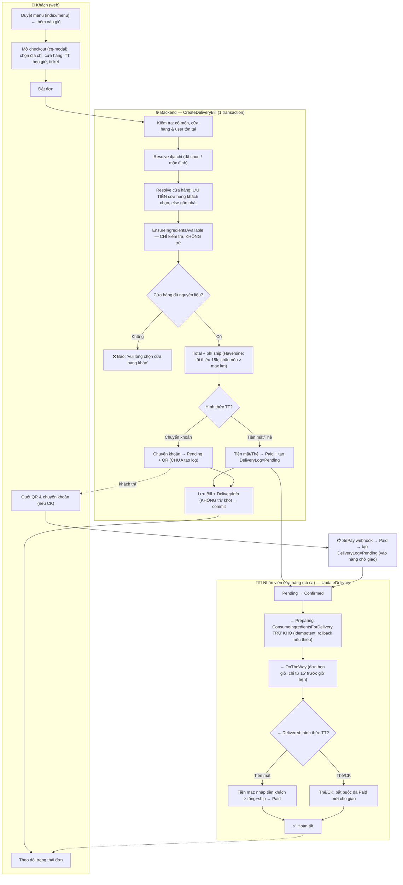
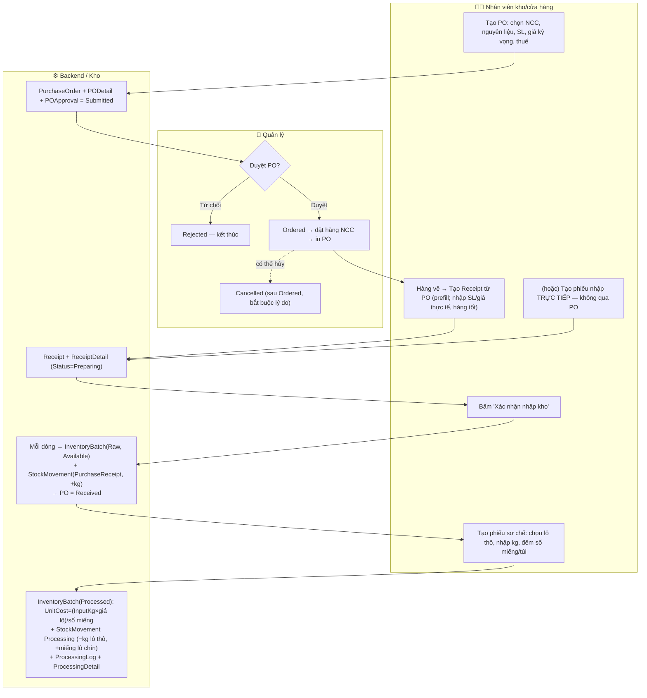
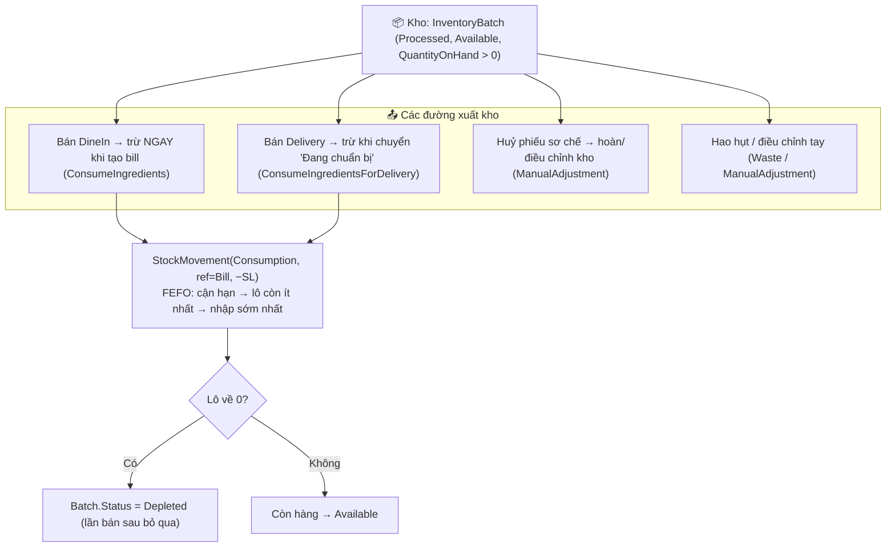

# Luồng hoạt động — Đặt Bill & Nhập/Xuất Kho

> Sơ đồ vẽ theo **đúng code hiện tại** (`BillService`, `DeliveryService`, `ReceiptService`,
> `PurchaseOrderService`, `ProcessingService`, `SePayService`). Mở bằng VS Code
> (Markdown Preview) hoặc bất kỳ trình xem Mermaid nào.

Quy ước lane (làn bơi):
- 👤 **Khách / User** (web) · 🧑‍🍳 **Nhân viên** · 👔 **Quản lý** · ⚙️ **Backend/Hệ thống** · 💳 **SePay**

---

## 1) Đặt bill TẠI QUÁN (DineIn) — nhân viên là người thao tác



**Lưu ý quan trọng:** DineIn **trừ kho ngay lúc tạo bill** (kể cả đơn chuyển khoản còn Pending).
Nếu thiếu nguyên liệu → rollback toàn bộ, hóa đơn không được tạo.

---

## 2) Đặt bill GIAO HÀNG (Delivery) — khách đặt, nhân viên xử lý



**Khác biệt cốt lõi với DineIn:** Delivery **KHÔNG trừ kho lúc đặt** — chỉ kiểm tra đủ hàng.
Kho bị trừ khi bếp chuyển **"Đang chuẩn bị" (Preparing)**. Đơn chuyển khoản chỉ vào hàng
chờ giao **sau khi** SePay xác nhận tiền.

---

## 3) NHẬP KHO — từ đặt mua đến lên kệ (đã sơ chế)



**2 loại nguyên liệu:** lô **Raw** (kg, nhập từ NCC) → qua **sơ chế** thành lô **Processed**
(miếng/Unit). Chỉ lô **Processed** mới được dùng để bán (trừ cho Bill).

---

## 4) XUẤT KHO — các đường tiêu hao tồn kho



---

## Bảng tóm tắt — thời điểm trừ kho & trạng thái

| Loại | Ai khởi tạo | Trừ kho khi nào | Hết hàng thì sao |
|---|---|---|---|
| **DineIn** | Nhân viên | **Ngay lúc tạo bill** (`ConsumeIngredients`) | Rollback cả bill |
| **Delivery** | Khách (web) | Khi nhân viên chuyển **Preparing** (`ConsumeIngredientsForDelivery`) | Lúc đặt: báo chọn cửa hàng khác. Lúc Preparing: rollback chuyển trạng thái |

| Dòng | Trạng thái |
|---|---|
| **Bill** (`BillStatus`) | Create → (UnPaid) → Paid → Delete |
| **Thanh toán** (`PaymentStatus`) | Pending → Paid / Failed |
| **Giao hàng** (`DeliveryStatus`) | Pending → Confirmed → Preparing → OnTheWay → Delivered _(/ Cancelled / Failed)_ |
| **PO** (`PO_Status`) | Submitted → Ordered → Received _(/ Rejected / Cancelled)_ |
| **Phiếu nhập** (`ReceiptStatus`) | Preparing → Delivering → Received _(/ Deleted)_ |
| **Lô kho** (`BatchStatus`) | Available → Depleted |
| **Loại lô** (`BatchType`) | Raw (kg) → Processed (miếng) |
```
