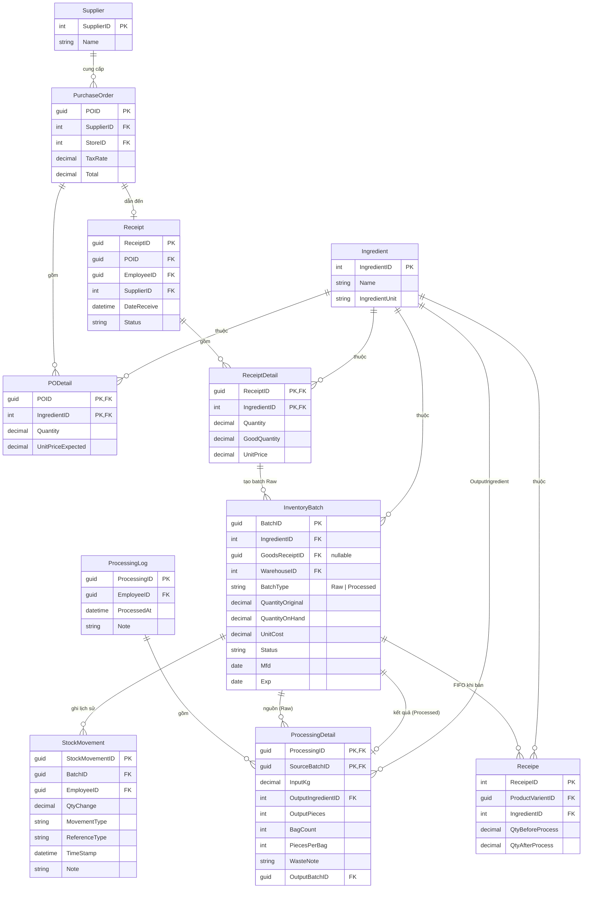

# Workflow Sơ Chế (Processing) — Hệ thống Quản lý Kho Gà Rán

## Mục đích tài liệu này

Ghi lại thiết kế luồng **sơ chế nguyên liệu** (chia miếng từ bao nhập) để:
- Chuyển đổi đơn vị từ **kg** (nhập từ NCC) sang **miếng/Unit** (bán ra)
- Tính chính xác **UnitCost từng miếng** dựa trên số lượng thực đếm
- Tự động **trừ kho** khi tạo Bill → tính được **lợi nhuận gộp** chính xác

---

## Luồng đầy đủ từng bước — Field Mapping

### Bước 1 — Tạo PO (nhân viên đặt hàng)

**Bảng ghi:** `PurchaseOrder` + `PODetail` + `POApproval`

```
PurchaseOrder
  POID              ← Guid.NewGuid()
  StoreID           ← nhân viên đăng nhập
  SupplierID        ← người dùng chọn
  TaxRate           ← người dùng nhập (VD: 0.10)
  Total             ← Σ(Quantity × UnitPriceExpected) × (1 + TaxRate)

PODetail
  POID              ← PurchaseOrder.POID
  IngredientID      ← người dùng chọn
  Quantity          ← người dùng nhập
  UnitPriceExpected ← người dùng nhập (giá kỳ vọng)

POApproval
  POID              ← PurchaseOrder.POID
  EmployeeID        ← nhân viên tạo PO
  Status            = Submitted
  LastUpdated       ← DateTime.UtcNow
```

---

### Bước 2 — Duyệt PO (quản lý xác nhận)

**Bảng ghi:** `POApproval` (update)

```
Status: Submitted → Approved → Ordered
Comment     ← quản lý nhập ghi chú
LastUpdated ← DateTime.UtcNow
```

> Khi `Status = Ordered` → **cho phép in PO** để gửi nhà cung cấp.

---

### Bước 3 — Hàng về, kiểm kê, tạo phiếu nhập

Nhân viên bấm **"Tạo phiếu nhập từ PO"** → hệ thống prefill từ PO, nhân viên điều chỉnh số lượng thực tế.

**Bảng ghi:** `Receipt` + `ReceiptDetail`

```
Receipt
  ReceiptID     ← Guid.NewGuid()                          [MỚI]
  POID          ← PurchaseOrder.POID                      [GÁN TỪ PO]
  SupplierID    ← PurchaseOrder.SupplierID                [GÁN TỪ PO]
  StoreID       ← PurchaseOrder.StoreID                   [GÁN TỪ PO]
  EmployeeID    ← nhân viên nhận hàng                     [MỚI]
  DateReceive   ← DateTime.UtcNow                         [MỚI]
  Status        = Received                                 [MỚI]

ReceiptDetail (mỗi dòng nguyên liệu)
  GoodsReceiptID  ← Receipt.ReceiptID
  IngredientID    ← PODetail.IngredientID                 [GÁN TỪ PO]
  Quantity        ← số kg giao thực tế (có thể ≠ PODetail.Quantity)    [NHÂN VIÊN NHẬP]
  GoodQuantity    ← số kg không bị hỏng                  [NHÂN VIÊN NHẬP]
  UnitPrice       ← giá thực tế trên hóa đơn (có thể ≠ UnitPriceExpected) [NHÂN VIÊN NHẬP]
```

---

### Bước 4 — Xác nhận nhập kho (tạo InventoryBatch)

Nhân viên bấm **"Xác nhận nhập"** → mỗi `ReceiptDetail` tạo 1 batch Raw + 1 StockMovement.

**Bảng ghi:** `InventoryBatch` + `StockMovement`

```
InventoryBatch (BatchType = Raw)
  BatchID           ← Guid.NewGuid()                      [MỚI]
  IngredientID      ← ReceiptDetail.IngredientID          [GÁN TỪ RECEIPT]
  GoodsReceiptID    ← Receipt.ReceiptID                   [GÁN TỪ RECEIPT]
  UnitCost          ← ReceiptDetail.UnitPrice             [GÁN TỪ RECEIPT]
  QuantityOriginal  ← ReceiptDetail.GoodQuantity          [GÁN TỪ RECEIPT]
  QuantityOnHand    ← ReceiptDetail.GoodQuantity          [GÁN TỪ RECEIPT]
  WarehouseID       ← nhân viên chọn kho                  [MỚI]
  Mfd               ← nhân viên nhập ngày sản xuất        [MỚI]
  Exp               ← nhân viên nhập hạn dùng             [MỚI]
  BatchCode         ← tự sinh (VD: BT-CANH-THO-20260511)  [MỚI]
  ImportDate        ← DateTime.UtcNow                     [MỚI]
  BatchType         = Raw                                  [MỚI]
  Status            = Available                            [MỚI]

StockMovement
  BatchID       ← InventoryBatch.BatchID
  EmployeeID    ← nhân viên xác nhận
  QtyChange     = +GoodQuantity
  MovementType  = PurchaseReceipt
  ReferenceType = GoodsReceipt
  TimeStamp     ← DateTime.UtcNow
```

> Đồng thời update `POApproval.Status = Received`.

---

### Bước 5 — Sơ chế (Processing)

Nhân viên bấm **"Tạo phiếu sơ chế"**, chọn batch Raw, nhập số miếng đếm được.

**Bảng ghi:** `ProcessingLog` + `ProcessingDetail` + `InventoryBatch` (mới Processed) + `StockMovement` (×2)

```
ProcessingLog
  ProcessingID  ← Guid.NewGuid()
  EmployeeID    ← nhân viên sơ chế
  ProcessedAt   ← DateTime.UtcNow
  Note          ← nhân viên nhập (tùy chọn)

ProcessingDetail
  ProcessingID       ← ProcessingLog.ProcessingID
  SourceBatchID      ← nhân viên chọn batch Raw từ kho    [CHỌN TỪ KHO]
  InputKg            ← nhân viên nhập (lấy bao nhiêu kg)  [NHẬP MỚI]
  OutputIngredientID ← nhân viên chọn (VD: Cánh gà—Unit)  [NHẬP MỚI]
  OutputPieces       ← nhân viên nhập (đếm được)          [NHẬP MỚI]
  BagCount           ← nhân viên nhập                     [NHẬP MỚI]
  PiecesPerBag       ← nhân viên nhập                     [NHẬP MỚI]
  WasteNote          ← nhân viên nhập (tùy chọn)
  OutputBatchID      ← InventoryBatch Processed (tạo bên dưới) [TỰ GÁN]

InventoryBatch (BatchType = Processed — tạo tự động)
  IngredientID      ← OutputIngredientID
  GoodsReceiptID    = null
  BatchType         = Processed
  QuantityOriginal  ← OutputPieces
  QuantityOnHand    ← OutputPieces
  UnitCost          ← (InputKg × SourceBatch.UnitCost) / OutputPieces  [TÍNH TỰ ĐỘNG]
  Mfd, Exp          ← nhân viên nhập (ghi trên túi cấp đông)
  Status            = Available

StockMovement #1 — trừ batch Raw
  BatchID       ← SourceBatch.BatchID
  QtyChange     = -InputKg
  MovementType  = Processing
  ReferenceType = Manual

StockMovement #2 — cộng batch Processed
  BatchID       ← OutputBatch.BatchID
  QtyChange     = +OutputPieces
  MovementType  = Processing
  ReferenceType = Manual
```

---

### Bước 6 — Bán (Bill)

Nhân viên tạo Bill → hệ thống tự trừ kho batch Processed theo FIFO trong cùng transaction.

Có 2 loại bill: **DineIn** (tại bàn) và **Delivery** (giao hàng). Cả hai đều gọi `ConsumeIngredients()` bên trong transaction.

#### Validation trước khi tạo bill

| Rule | DineIn | Delivery |
|---|---|---|
| `products` không rỗng | ✅ | ✅ |
| `EmployeeID` không null | ✅ | ✅ |
| `StoreID` tồn tại và chưa xóa | ✅ | ✅ |
| `TableID` tồn tại và không Occupied | ✅ (nếu có) | — |
| `UserID` tồn tại | — | ✅ |
| `MoneyReceived >= Total` | ✅ (sau tính total) | ✅ (sau tính total) |

#### Field mapping — Bill

```
Bill
  BillID           ← Guid.NewGuid()
  UserID           ← từ contact (DineIn) hoặc request.UserID (Delivery); Guid.Empty nếu khách vãng lai
  StoreID          ← request.StoreID
  TableID          ← request.TableID (DineIn, nullable)
  AddressID        ← request.AddressID hoặc địa chỉ mặc định của user (Delivery)
  PaymentMethods   ← request.PaymentMethods
  Note             ← request.Note
  MoneyReceived    ← request.MoneyReceived
  VAT              = 0.1 (10%, mặc định)
  Total            ← Σ(Price × qty) × (1 + VAT)   [tính server-side]
  MoneyGiveBack    ← MoneyReceived - Total

BillDetail (mỗi sản phẩm trong bill)
  BillID           ← Bill.BillID
  ProductVarientID ← request.products[i].ProductVarientID
  Quantity         ← request.products[i].qty
  Price            ← GetPriceByID(ProductVarientID)   [lấy từ DB]
  InlineTotal      ← Price × Quantity

BillChange (trạng thái đầu tiên)
  BillID           ← Bill.BillID
  Status           = Create
  EmployeeID       ← request.EmployeeID
  ChangeAt         ← DateTime.UtcNow
```

#### Field mapping — DeliveryInfo (chỉ Delivery)

```
DeliveryInfo
  DeliveryID   ← Guid.NewGuid()
  BillID       ← Bill.BillID
  UserID       ← Bill.UserID
  AddressID    ← addressID đã resolve
  Note         ← request.NoteForDelivery
  ShippingFee  = 0 (chưa có logic tính phí ship)

DeliveryLog (trạng thái đầu tiên)
  DeliveryID   ← DeliveryInfo.DeliveryID
  Status       = Pending
  ChangeAt     ← DateTime.UtcNow
  Note         ← request.NoteForDelivery
```

#### ConsumeIngredients — FIFO trừ kho

Gọi sau khi `SaveChangesAsync()` nhưng vẫn trong cùng transaction — nếu hết hàng thì rollback cả bill.

```
Với mỗi BillDetail (ProductVarientID, Quantity):
  → Lấy Recipe: WHERE ProductVarientID = X AND DeletedAt IS NULL
  → Với mỗi Recipe item (IngredientID, QtyAfterProcess):
       totalToConsume = QtyAfterProcess × BillDetail.Quantity

       FIFO query:
         InventoryBatch WHERE
           IngredientID = recipe.IngredientID
           AND BatchType = Processed
           AND Status = Available
           AND QuantityOnHand > 0
           AND Exp >= today                ← loại batch hết hạn
           AND Warehouse.StoreID = storeID ← chỉ lấy kho của store đang bán
         ORDER BY ImportDate ASC           ← cũ nhất trước

       Trừ dần qua nhiều batch:
         deduct = Min(remaining, batch.QuantityOnHand)
         batch.QuantityOnHand -= deduct
         nếu QuantityOnHand == 0 → Status = Depleted
         tạo StockMovement(Consumption, Bill, QtyChange = -deduct)
         remaining -= deduct

       Nếu remaining > 0 sau khi hết batch → throw (hết hàng → rollback cả bill)
```

#### StockMovement tạo ra khi bán

```
StockMovement (mỗi batch bị trừ)
  BatchID       ← batch.BatchID (Processed)
  EmployeeID    ← employeeID
  QtyChange     ← -deduct  (âm)
  MovementType  = Consumption
  ReferenceType = Bill
  ReferenceID   ← Bill.BillID
  TimeStamp     ← DateTime.UtcNow
```

---

### Tổng quan field flow

```
[NCC]
  │
  ▼
PurchaseOrder (POID, SupplierID, StoreID, TaxRate, Total)
  │  POApproval: Submitted → Approved → Ordered  → [IN PO]
  │
  ▼  [hàng về, kiểm kê]
Receipt  ←── GÁN: POID, SupplierID, StoreID
  +EmployeeID, +DateReceive
  │
  ▼
ReceiptDetail  ←── GÁN: IngredientID từ PODetail
  +Quantity(thực tế), +GoodQuantity, +UnitPrice(thực tế)
  │
  ▼  [xác nhận nhập]
InventoryBatch (Raw)  ←── GÁN: IngredientID, GoodsReceiptID, UnitCost, QuantityOnHand
  BatchType=Raw, +WarehouseID, +Mfd, +Exp, +BatchCode
  + StockMovement (PurchaseReceipt, +Qty)
  │
  ▼  [sơ chế]
InventoryBatch (Processed)  ←── tính UnitCost = (InputKg × UnitCost) / OutputPieces
  BatchType=Processed, GoodsReceiptID=null
  + StockMovement #1 (Processing, -InputKg từ Raw)
  + StockMovement #2 (Processing, +OutputPieces vào Processed)
  + ProcessingLog + ProcessingDetail
  │
  ▼  [bán]
Bill → BillDetail → Recipe → FIFO Processed batches
  + StockMovement (Consumption, -miếng)
  → COGS = Σ(deduct × UnitCost)
  → GrossProfit = Revenue - COGS
```

---

## Bức tranh tổng thể

```
[NCC] → Bao Cánh gà 10kg
             │ (Nhập hàng — InventoryBatch, đơn vị: Kilogram)
             ▼
[Sơ chế] Mở bao, đếm miếng, chia túi nhỏ, cấp đông
  Input:  10kg Cánh gà thô
  Output: 67 miếng Cánh gà (đơn vị: Unit)
  → UnitCost = (10kg × 50,000đ/kg) / 67 = 7,463đ/miếng
             │ (ProcessingLog + ProcessingDetail)
             ▼
[Kho] InventoryBatch mới: Cánh gà — 67 miếng, 7,463đ/miếng
             │ (Batch-level FIFO)
             ▼
[Bán] Bill: Combo cánh 3 miếng
  Recipe.QtyAfterProcess = 3 miếng
  → StockMovement(Consumption): -3 miếng
  → COGS = 3 × 7,463đ = 22,388đ
  → Revenue = 45,000đ
  → Gross Profit = 22,612đ ✅
```

---

## Ingredient — 2 loại cần phân biệt

Mỗi loại nguyên liệu gà cần **2 bản ghi Ingredient riêng**:

| IngredientName     | IngredientUnit | Mô tả                              |
|--------------------|----------------|------------------------------------|
| Cánh gà thô        | Kilogram       | Nhập từ NCC, dùng trong Receipt    |
| Cánh gà            | Unit           | Sau sơ chế, dùng trong Recipe/Bill |
| Đùi gà thô         | Kilogram       | Nhập từ NCC                        |
| Đùi gà             | Unit           | Sau sơ chế                         |
| Ức gà thô          | Kilogram       | Nhập từ NCC                        |
| Ức gà              | Unit           | Sau sơ chế                         |

> **Lý do tách:** Recipe chỉ tham chiếu loại "đã sơ chế (Unit)" để trừ kho chính xác theo miếng.

---

## Recipe (Receipe) — cách dùng đúng

Model `Receipe` đã có sẵn `QtyBeforeProcess` và `QtyAfterProcess`:

```
ProductVarient: "Combo cánh 3 miếng"
  └─ Receipe:
       IngredientID       = [ID của "Cánh gà" — Unit]
       QtyBeforeProcess   = 0   (không dùng trong trường hợp này — đã qua sơ chế)
       QtyAfterProcess    = 3   (trừ 3 miếng từ kho khi bán 1 combo)
```

> `ConsumeIngredients()` dùng `QtyAfterProcess` để trừ từ batch miếng.

---

## Bảng dữ liệu mới

### 1. `ProcessingLog` — Phiếu sơ chế

Mỗi lần nhân viên ngồi sơ chế 1 hoặc nhiều bao là 1 ProcessingLog.

| Field         | Type      | Ghi chú                             |
|---------------|-----------|-------------------------------------|
| ProcessingID  | Guid (PK) | Khóa chính                          |
| EmployeeID    | Guid (FK) | Nhân viên thực hiện sơ chế          |
| ProcessedAt   | DateTime  | Thời điểm sơ chế                    |
| Note          | string?   | Ghi chú tự do (nếu có vấn đề gì)   |

### 2. `ProcessingDetail` — Chi tiết từng bao trong phiếu sơ chế

Composite PK: `(ProcessingID + SourceBatchID)` — 1 phiếu có thể xử lý nhiều bao.

| Field              | Type      | Ghi chú                                             |
|--------------------|-----------|-----------------------------------------------------|
| ProcessingID       | Guid (FK) | FK → ProcessingLog                                  |
| SourceBatchID      | Guid (FK) | FK → InventoryBatch (batch gà thô kg)               |
| InputKg            | decimal   | Số kg thực tế lấy từ bao để sơ chế                  |
| OutputIngredientID | int (FK)  | FK → Ingredient (loại "Unit" — cánh/đùi/ức)         |
| OutputPieces       | int       | Số miếng đếm được thực tế                           |
| BagCount           | int       | Số túi nhỏ chia ra để cấp đông (metadata ops)       |
| PiecesPerBag       | int       | Số miếng mỗi túi (approx, cho ops biết khi lấy)    |
| WasteNote          | string?   | Ghi chú hao hụt (xương vụn, da thừa...)             |
| OutputBatchID      | Guid (FK) | FK → InventoryBatch mới (batch miếng — tự tạo)      |

---

## Thay đổi bảng hiện có

### `StockMovementType` — thêm enum value ✅ Done

```csharp
Processing = 6   // Dùng cho cả input (trừ kg) và output (thêm miếng) của sơ chế
```

### `InventoryBatch.GoodsReceiptID` — đổi thành nullable ✅ Done

```csharp
public Guid? GoodsReceiptID { get; set; }
// Batch tạo từ sơ chế không có GoodsReceiptID → null
```

### `InventoryBatch.BatchType` — thêm enum mới ✅ Done

Phân biệt batch thô (kg) và batch miếng (Unit) mà không cần join sang Ingredient.

```csharp
public enum BatchType
{
    Raw,        // Nhập từ NCC — đơn vị kg, nguồn của Processing
    Processed   // Sau sơ chế — đơn vị miếng/Unit, nguồn của Bill
}

// Trong InventoryBatch:
public BatchType BatchType { get; set; }
```

| Tạo từ | BatchType | GoodsReceiptID |
|--------|-----------|----------------|
| Receipt nhập hàng | `Raw` | có giá trị |
| Processing sơ chế | `Processed` | `null` |

> Khi query FIFO để bán Bill → chỉ lấy batch có `BatchType = Processed`.

---

## Các hàm mới

### A. `IProcessingService` / `ProcessingService`

| Hàm                                                      | Mô tả                                                   |
|----------------------------------------------------------|---------------------------------------------------------|
| `CreateProcessing(CreateProcessingRequest)`              | Tạo phiếu sơ chế: trừ batch kg, tạo batch miếng        |
| `GetAllProcessing(DateOnly start, DateOnly end)`         | Lấy danh sách phiếu sơ chế theo khoảng ngày            |
| `GetProcessingByID(Guid processingID)`                   | Lấy chi tiết 1 phiếu sơ chế                            |

**Request DTO: `CreateProcessingRequest`**
```
EmployeeID         Guid
WarehouseID        int
Note               string?
Items:
  └─ SourceBatchID      Guid      (batch gà thô)
  └─ InputKg            decimal   (lấy bao nhiêu kg từ batch đó)
  └─ OutputIngredientID int       (Ingredient "Cánh gà" Unit)
  └─ OutputPieces       int       (đếm được bao nhiêu miếng)
  └─ BagCount           int       (chia bao nhiêu túi)
  └─ PiecesPerBag       int       (mỗi túi bao nhiêu miếng)
  └─ Exp                DateOnly  (hạn dùng — ghi trên túi/bao)
  └─ Mfd                DateOnly  (ngày sản xuất)
  └─ WasteNote          string?   (ghi chú hao hụt)
```

**Logic bên trong `CreateProcessing()`:**
```
1. Validate: batch nguồn tồn tại + đủ kg
2. Tính UnitCost mới = (InputKg × sourceBatch.UnitCost) / OutputPieces
3. Trừ QuantityOnHand của batch nguồn
4. Nếu QuantityOnHand = 0 → Status = Depleted
5. Tạo StockMovement(Processing) cho batch nguồn: QtyChange = -InputKg
6. Tạo InventoryBatch mới (đơn vị miếng): QuantityOriginal = OutputPieces
7. Tạo StockMovement(Processing) cho batch mới: QtyChange = +OutputPieces
8. Tạo ProcessingDetail liên kết 2 batch
9. Toàn bộ trong 1 transaction
```

---

### B. `ConsumeIngredients()` — private trong `BillService`

Gọi sau khi `CreateDineInBill()` và `CreateDeliveryBill()` tạo xong Bill.

| Tham số   | Type              | Mô tả                           |
|-----------|-------------------|---------------------------------|
| billID    | Guid              | Bill vừa tạo                    |
| billDetails | List<BillDetail> | Danh sách sản phẩm trong bill  |
| employeeID | Guid             | Nhân viên tạo bill              |

**Logic bên trong:**
```
Với mỗi BillDetail (ProductVarientID, Quantity):
  → Lấy Recipe: WHERE ProductVarientID = X AND DeletedAt IS NULL
  → Với mỗi Recipe item:
       totalToConsume = Recipe.QtyAfterProcess × BillDetail.Quantity
       → FIFO: lấy batch cũ nhất có QuantityOnHand > 0 cho IngredientID đó
       → Trừ dần qua nhiều batch nếu cần
       → Tạo StockMovement(Consumption, ReferenceType: Bill) mỗi batch bị trừ
       → Nếu hết hàng trước khi trừ đủ → throw Exception
```

> **Gọi trong transaction của CreateBill** để nếu ConsumeIngredients fail thì Bill cũng rollback.

---

## Cách tính lợi nhuận

### COGS (Cost of Goods Sold) — từ StockMovement

```sql
-- Lấy tổng chi phí nguyên liệu cho 1 bill:
SELECT SUM(sm.QtyChange * ib.UnitCost) AS COGS
FROM StockMovement sm
JOIN InventoryBatch ib ON sm.BatchID = ib.BatchID
WHERE sm.ReferenceType = 'Bill'
  AND sm.Note LIKE '%BillID%'
  AND sm.MovementType = 'Consumption'
```

### Gross Profit — từ Bill + StockMovement

```
Revenue   = Bill.Total / (1 + Bill.VAT)   ← doanh thu chưa thuế
COGS      = Σ (|QtyChange| × InventoryBatch.UnitCost)  ← từ StockMovement của bill đó
GrossProfit = Revenue - COGS
```

### Ví dụ thực tế

```
Nhập:  10kg Cánh gà @ 50,000đ/kg = 500,000đ
Sơ chế: 67 miếng → UnitCost = 7,463đ/miếng

Bán Combo cánh 3 miếng, giá 45,000đ:
  Revenue = 45,000đ / 1.1 = 40,909đ
  COGS    = 3 × 7,463đ   = 22,388đ
  Gross Profit = 18,521đ  (~45% margin)
```

---

## ERD — Luồng nhập → sơ chế → bán



### Ghi chú luồng theo BatchType

```
[Receipt] ──tạo──► InventoryBatch (BatchType=Raw)
                         │
                         │ ProcessingDetail.SourceBatchID
                         ▼
                   [ProcessingLog]
                         │
                         │ ProcessingDetail.OutputBatchID
                         ▼
                   InventoryBatch (BatchType=Processed)
                         │
                         │ ConsumeIngredients() — FIFO
                         ▼
                   StockMovement (Consumption)
                         │
                         ▼
                   [Bill] → tính COGS, Gross Profit
```

---

## Migration cần tạo

```bash
# Sau khi thêm model ProcessingLog, ProcessingDetail
# và đổi GoodsReceiptID thành nullable:
dotnet ef migrations add AddProcessingTables
dotnet ef database update
```

Các thay đổi migration bao gồm:
- Tạo bảng `ProcessingLog`
- Tạo bảng `ProcessingDetail`
- Sửa `InventoryBatch.GoodsReceiptID` thành nullable
- Thêm cột `InventoryBatch.BatchType` (enum: Raw | Processed)
- Thêm `StockMovementType.Processing = 6`

---

## Thứ tự implement

```
✅ 1. Thêm enum Processing vào StockMovementType
✅ 2. Sửa InventoryBatch.GoodsReceiptID → Guid?
✅ 3. Thêm BatchType enum + field vào InventoryBatch
✅ 4. Tạo ProcessingLog.cs + ProcessingDetail.cs (model)
   5. Thêm DbSet vào AppDbContext + cấu hình composite PK ProcessingDetail
   6. Tạo migration + update DB
   7. Viết ProcessingRequest DTO
   8. Viết IProcessingService + ProcessingService
      - CreateProcessing(): gán BatchType=Raw cho source, BatchType=Processed cho output
   9. Đăng ký DI trong Program.cs
  10. Viết ConsumeIngredients() trong BillService (chỉ FIFO batch BatchType=Processed)
  11. Gọi ConsumeIngredients() trong CreateDineInBill + CreateDeliveryBill
  12. Seed dữ liệu Ingredient (loại thô + loại Unit) và Recipe
```
